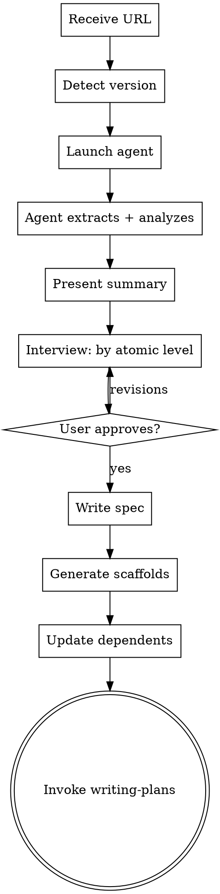

# Design System Component Sync

Extract atomic design components from an external design system and scaffold them into the codebase as React + SCSS files. Components are auto-sorted to the correct location using placement rules, with an interview for ambiguous cases only.

All output is versioned under `docs/design/` alongside token extraction output — components write to a `components/` subdirectory within the version folder.

## Placement Rules

| Design System Category | Target Location | Rule |
|---|---|---|
| Atoms: Buttons, Pills, Forms, Dividers, Tooltips | `src/components/controls/` | Generic UI primitives — no domain knowledge |
| Atoms: Date & Time, Location Chip | `src/components/indicators/` | Display-only data presentation |
| Molecules: Avatars, Tabs, Pagination, Quantity Stepper, Search Input | `src/components/controls/` | Reusable across features |
| Molecules: Rating Display, Inline Banner, Settings Row, Notification Row | `src/components/indicators/` | Status/info display |
| Molecules: Page Header, Stepper & Progress | `src/components/layout/` | Structural/layout |
| Molecules: Product Cards, Seller Card, Photo Upload, Shipping Rate Card, Category Tile, Watchlist Toggle | `src/features/listings/components/` | Listing domain |
| Molecules: Messaging | `src/features/messaging/components/` | Messaging domain |
| Molecules: Filter Panel | `src/features/search/components/` | Search domain |
| Molecules: Order Timeline | `src/features/orders/components/` | Orders domain |
| Trust & Identity: all | `src/features/members/components/` | Member/trust domain |
| Dashboard: all | `src/features/dashboard/components/` | Dashboard domain |
| Unique/Editorial: all | `src/features/editorial/components/` | Editorial/discovery domain |
| Organisms: Modals, Overlays | `src/components/layout/` | Global structural |
| Feedback: Loading States, Empty States, Error States, Toasts | `src/components/indicators/` | Global feedback |
| Navigation: Navigation System | `src/components/navigation/` | Global nav |
| Patterns: Voice & Tone | `docs/design/{version}/voice-and-tone.md` | Documentation only, not a component |

Only components that don't match any rule are flagged during the interview.

## Directory Structure

```
docs/design/
├── v1/
│   ├── extraction.md              # Token extraction (from ds-sync)
│   ├── diff-report.md             # Token diff (from ds-sync)
│   ├── spec.md                    # Token spec (from ds-sync)
│   ├── components/                # Component extraction (from ds-sync-components)
│   │   ├── extraction.md          # Full component extraction
│   │   ├── placement.md           # Placement decisions
│   │   ├── data-mapping.md        # Data wiring decisions
│   │   ├── spec.md                # Approved component spec
│   │   ├── screenshots/           # Component section screenshots
│   │   └── metadata.json          # Component counts and categories
│   ├── screenshots/               # Token screenshots (from ds-sync)
│   └── metadata.json              # Token metadata (from ds-sync)
├── latest -> v1/
└── component-showcase-reference.html  # Design system reference HTML
```

## Process



## Steps

### 1. Detect Version

Scan `docs/design/` for existing `v*` directories. Reuse the highest version — components share a version with tokens and write to a `components/` subdirectory. If no version exists, create `v1`.

### 2. Launch Extraction Agent

Dispatch the **ds-sync-components** agent with:
- `url`: The design system URL from the user's argument
- `version`: Detected version

Wait for the agent to complete. It produces extraction docs and placement analysis in `docs/design/{version}/components/`.

### 3. Present the Extraction Summary

Summarize for the user:
- Component count per atomic level (atoms, molecules, organisms, etc.)
- Auto-sorted placement table showing where each component will go
- Which components already exist in the codebase (will be skipped)
- Which have existing data layers (will get live wiring) vs. typed props only
- Any ambiguous placements flagged for review

### 4. Interview — Batched by Atomic Level

Walk through each batch one at a time:
1. **Placement review** — Show auto-sorted table, ask about any moves
2. **Atoms** — Batch: variants, states, naming conventions
3. **Molecules (global)** — Components going to `src/components/`
4. **Molecules (feature-scoped)** — Components going to `src/features/*/components/`
5. **Trust & Identity** — Batch
6. **Dashboard** — Batch
7. **Unique/Editorial** — Batch
8. **Organisms** — Batch
9. **Feedback** — Batch
10. **Data wiring review** — Show live-wired vs. typed-props-only, ask if any need data layer scaffolding now

Each batch is **one message with one question**. User can approve the whole batch or flag specific components for revision.

### 5. Write Component Spec

Once all batches are approved, write `docs/design/{version}/components/spec.md` with:
- All approved component definitions (final naming, placement, variants, props)
- Data wiring decisions
- Scaffold instructions

Commit the spec.

### 6. Generate Scaffolds

Create component directories in their target locations. Each component gets:
- `component-name/index.tsx` — React component with typed props
- `component-name/component-name.module.scss` — CSS Module with tokens

Skip components marked as "existing" in the placement report.

### 7. Update Dependents

- Append to `src/components/controls/index.ts` barrel (the only barrel that exists)
- Update feature CLAUDE.md files
- Create new feature directories with minimal CLAUDE.md for domains that don't exist
- Do NOT add scaffolds to the showcase page — add when finalized

### 8. Transition

Invoke the **writing-plans** skill (using `Skill` tool with `skill: 'superpowers:writing-plans'`) to create a phased implementation plan for finalizing the scaffolded components.

## Key Rules

- Never skip the interview. Every component batch goes through the user.
- One question per message during the interview.
- The user's naming preferences override the design system's naming.
- Only ask about ambiguous placements — auto-sort handles the rest.
- If the design system has components not in the codebase, scaffold them.
- If the codebase has components not in the design system, note them but don't remove.
- All extraction docs go in `docs/design/{version}/components/`, not scattered.
- Screenshots go in `docs/design/{version}/components/screenshots/`.
- Do NOT add scaffolded components to the showcase page.
- When new feature domains are created, add a minimal CLAUDE.md.
