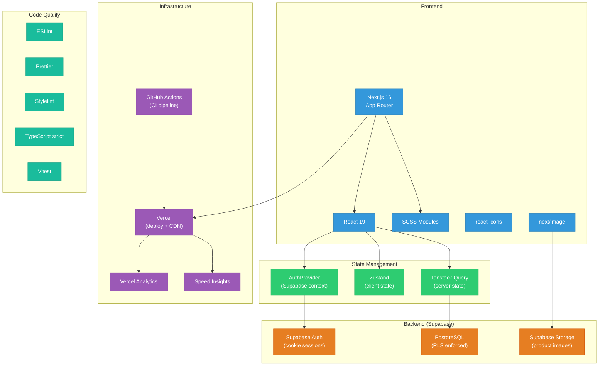
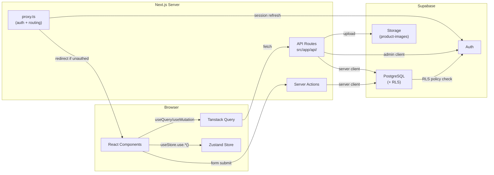
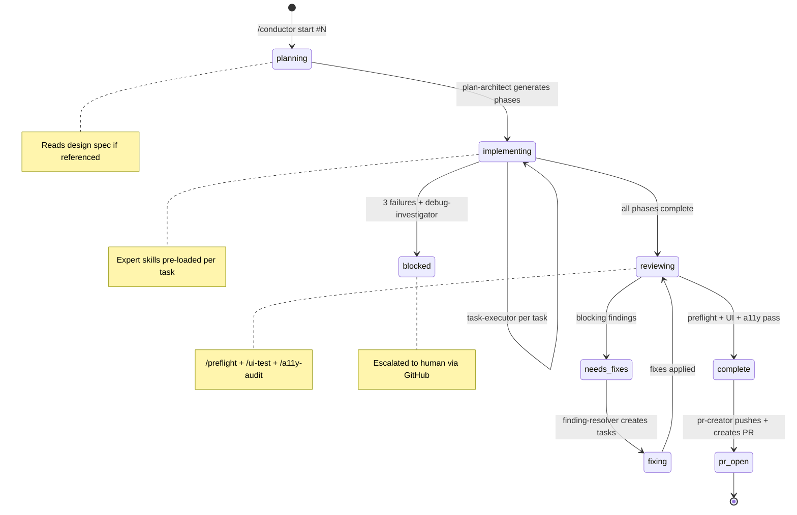

# Nessi Fleet Architecture

## Skill & Agent Pipeline

```mermaid
flowchart TB
    subgraph USER["Developer Commands"]
        FP["/feature-pipeline"]
        DS["/design-spec"]
        TG["/ticket-gen"]
        CS["/conductor start #N"]
        PF["/preflight"]
        AU["/audit"]
        MA["/marketplace-audit"]
        A11Y["/a11y-audit"]
        UT["/ui-test"]
        FS["/feature-scaffold"]
        DM["/db-migrate"]
        WT["/write-tests"]
        DBG["/debug"]
    end

    subgraph EXPERTS["Tech Expert Skills (auto-trigger on file edits)"]
        ASK_SB["/ask-supabase<br/>src/libs/supabase/*"]
        ASK_NJ["/ask-nextjs<br/>src/app/**"]
        ASK_VC["/ask-vercel<br/>vercel.json"]
        ASK_SC["/ask-scss<br/>*.module.scss"]
        ASK_ST["/ask-state<br/>*/hooks/*, */stores/*"]
    end

    subgraph DESIGN["Design Intelligence"]
        UXR["ux-researcher<br/>(agent)"]
        MAA["marketplace-audit<br/>(agent)"]
    end

    subgraph CONDUCTOR["Conductor Pipeline"]
        PA["plan-architect<br/>(agent, opus)"]
        TE["task-executor<br/>(agent)"]
        PV["phase-verifier<br/>(agent)"]
        RO["review-orchestrator<br/>(agent)"]
        FR["finding-resolver<br/>(agent)"]
        DI["debug-investigator<br/>(agent, opus)"]
        PR["pr-creator<br/>(agent)"]
        TGN["ticket-generator<br/>(agent)"]
    end

    subgraph TESTING["Testing & Debugging"]
        UIT["ui-tester<br/>(agent)"]
        BD["browser-debug<br/>(agent)"]
        A11A["a11y-auditor<br/>(agent)"]
        TAU["test-author<br/>(agent)"]
    end

    subgraph OUTPUTS["Outputs"]
        SPEC["docs/design-specs/*.md"]
        ISSUES["GitHub Issues<br/>(Kanban Board)"]
        PROUT["Pull Request"]
    end

    %% Feature Pipeline flow
    FP --> DS
    FP --> TG
    FP -.-> CS

    %% Design flow
    DS --> UXR
    UXR --> SPEC

    %% Ticket flow
    TG --> TGN
    TGN --> ISSUES
    SPEC -.->|"referenced in tickets"| ISSUES

    %% Conductor flow
    CS --> PA
    PA --> TE
    TE --> PV
    PV --> RO
    RO -->|"clean"| PR
    RO -->|"needs fixes"| FR
    FR --> TE
    TE -->|"3rd failure"| DI
    DI --> TE
    PR --> PROUT
    PROUT --> ISSUES

    %% Expert pre-loading
    ASK_SB -.->|"expert context"| TE
    ASK_NJ -.->|"expert context"| TE
    ASK_VC -.->|"expert context"| TE
    ASK_SC -.->|"expert context"| TE
    ASK_ST -.->|"expert context"| TE

    %% Quality gates
    PF --> RO
    AU --> PF
    AU --> MA
    AU --> A11Y
    MA --> MAA
    A11Y --> A11A
    UT --> UIT
    UIT -->|"issues found"| BD

    %% Dev tools
    WT --> TAU
    DBG --> DI

    %% Styling
    classDef skill fill:#4A90D9,stroke:#2C5F8A,color:#fff
    classDef agent fill:#2ECC71,stroke:#1A9B54,color:#fff
    classDef opus fill:#E74C3C,stroke:#C0392B,color:#fff
    classDef output fill:#F39C12,stroke:#D68910,color:#fff
    classDef expert fill:#9B59B6,stroke:#7D3C98,color:#fff

    class FP,DS,TG,CS,PF,AU,MA,A11Y,UT,FS,DM,WT,DBG skill
    class UXR,MAA,TE,PV,RO,FR,PR,TGN,UIT,BD,A11A,TAU agent
    class PA,DI opus
    class SPEC,ISSUES,PROUT output
    class ASK_SB,ASK_NJ,ASK_VC,ASK_SC,ASK_ST expert
```

## Tech Stack

```mermaid
graph TB
    subgraph FRONTEND["Frontend"]
        NJ["Next.js 16<br/>App Router"]
        R19["React 19"]
        SCSS["SCSS Modules"]
        RI["react-icons"]
        NI["next/image"]
    end

    subgraph STATE["State Management"]
        TQ["Tanstack Query<br/>(server state)"]
        ZS["Zustand<br/>(client state)"]
        AC["AuthProvider<br/>(Supabase context)"]
    end

    subgraph BACKEND["Backend (Supabase)"]
        SA["Supabase Auth<br/>(cookie sessions)"]
        SP["PostgreSQL<br/>(RLS enforced)"]
        SS["Supabase Storage<br/>(product images)"]
    end

    subgraph INFRA["Infrastructure"]
        VC["Vercel<br/>(deploy + CDN)"]
        GA["GitHub Actions<br/>(CI pipeline)"]
        VA["Vercel Analytics"]
        VS["Speed Insights"]
    end

    subgraph QUALITY["Code Quality"]
        ES["ESLint"]
        PR["Prettier"]
        SL["Stylelint"]
        TS["TypeScript strict"]
        VT["Vitest"]
    end

    NJ --> R19
    NJ --> SCSS
    R19 --> TQ
    R19 --> ZS
    R19 --> AC
    AC --> SA
    TQ --> SP
    NI --> SS
    NJ --> VC
    GA --> VC
    VC --> VA
    VC --> VS

    classDef frontend fill:#3498DB,stroke:#2980B9,color:#fff
    classDef state fill:#2ECC71,stroke:#27AE60,color:#fff
    classDef backend fill:#E67E22,stroke:#D35400,color:#fff
    classDef infra fill:#9B59B6,stroke:#8E44AD,color:#fff
    classDef quality fill:#1ABC9C,stroke:#16A085,color:#fff

    class NJ,R19,SCSS,RI,NI frontend
    class TQ,ZS,AC state
    class SA,SP,SS backend
    class VC,GA,VA,VS infra
    class ES,PR,SL,TS,VT quality
```

## Data Flow

```mermaid
flowchart LR
    subgraph CLIENT["Browser"]
        UI["React Components"]
        TQ["Tanstack Query"]
        ZS["Zustand Store"]
    end

    subgraph SERVER["Next.js Server"]
        API["API Routes<br/>src/app/api/"]
        SA["Server Actions"]
        PX["proxy.ts<br/>(auth + routing)"]
    end

    subgraph SUPABASE["Supabase"]
        AUTH["Auth"]
        DB["PostgreSQL<br/>(+ RLS)"]
        STOR["Storage<br/>(product-images)"]
    end

    UI -->|"useQuery/useMutation"| TQ
    UI -->|"useStore.use.*()"| ZS
    TQ -->|"fetch"| API
    UI -->|"form submit"| SA
    PX -->|"session refresh"| AUTH
    PX -->|"redirect if unauthed"| UI
    API -->|"server client"| DB
    API -->|"admin client"| AUTH
    SA -->|"server client"| DB
    API -->|"upload"| STOR
    DB -->|"RLS policy check"| AUTH
```

## Conductor Pipeline

```mermaid
stateDiagram-v2
    [*] --> planning: /conductor start #N
    planning --> implementing: plan-architect generates phases
    implementing --> reviewing: all phases complete
    reviewing --> complete: preflight + UI + a11y pass
    reviewing --> needs_fixes: blocking findings
    needs_fixes --> fixing: finding-resolver creates tasks
    fixing --> reviewing: fixes applied
    complete --> pr_open: pr-creator pushes + creates PR
    pr_open --> [*]

    implementing --> implementing: task-executor per task
    implementing --> blocked: 3 failures + debug-investigator

    note right of planning: Reads design spec if referenced
    note right of implementing: Expert skills pre-loaded per task
    note right of reviewing: /preflight + /ui-test + /a11y-audit
    note right of blocked: Escalated to human via GitHub
```
