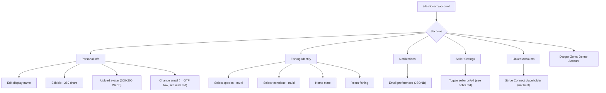
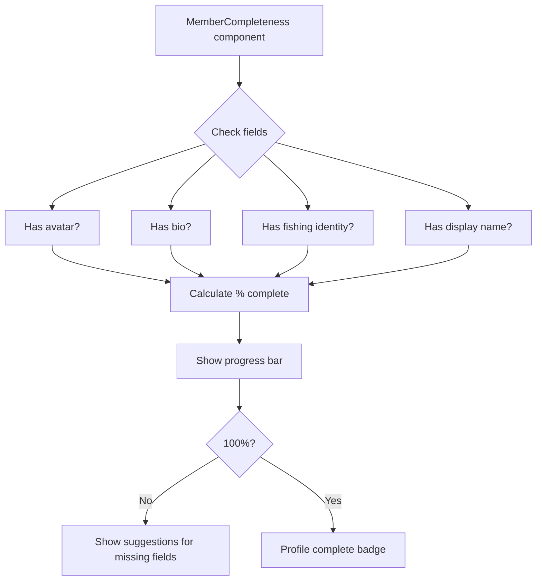
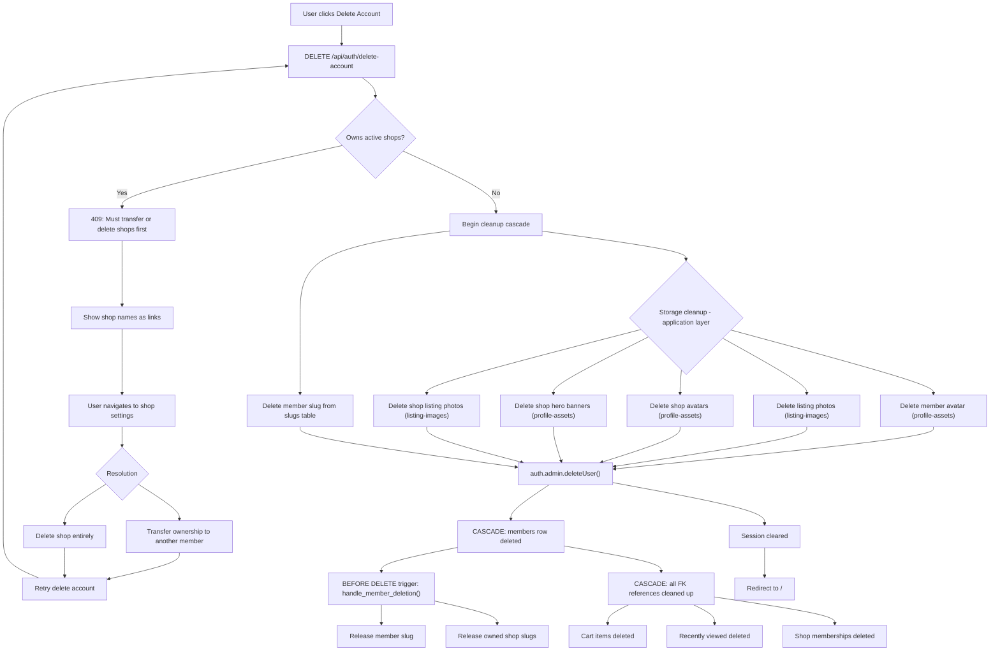
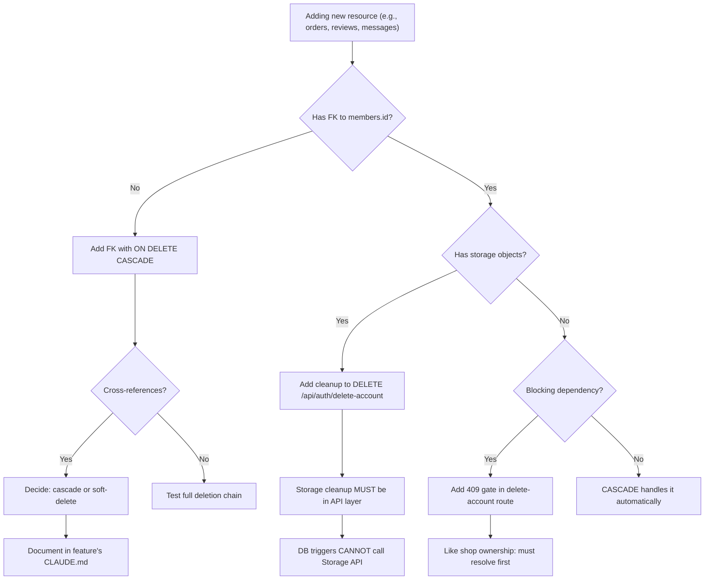

# Account Management Flows

Profile editing, seller toggle, email change, account deletion.

## Account Settings Page

## Profile Completeness

## Account Deletion (Full Cascade)

## Adding New User-Owned Resources (Dev Guide)

