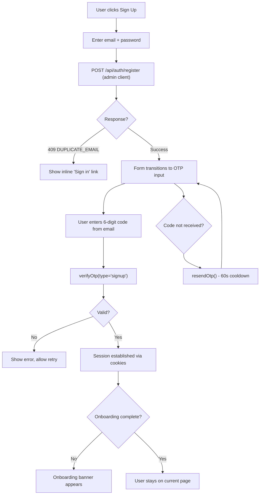
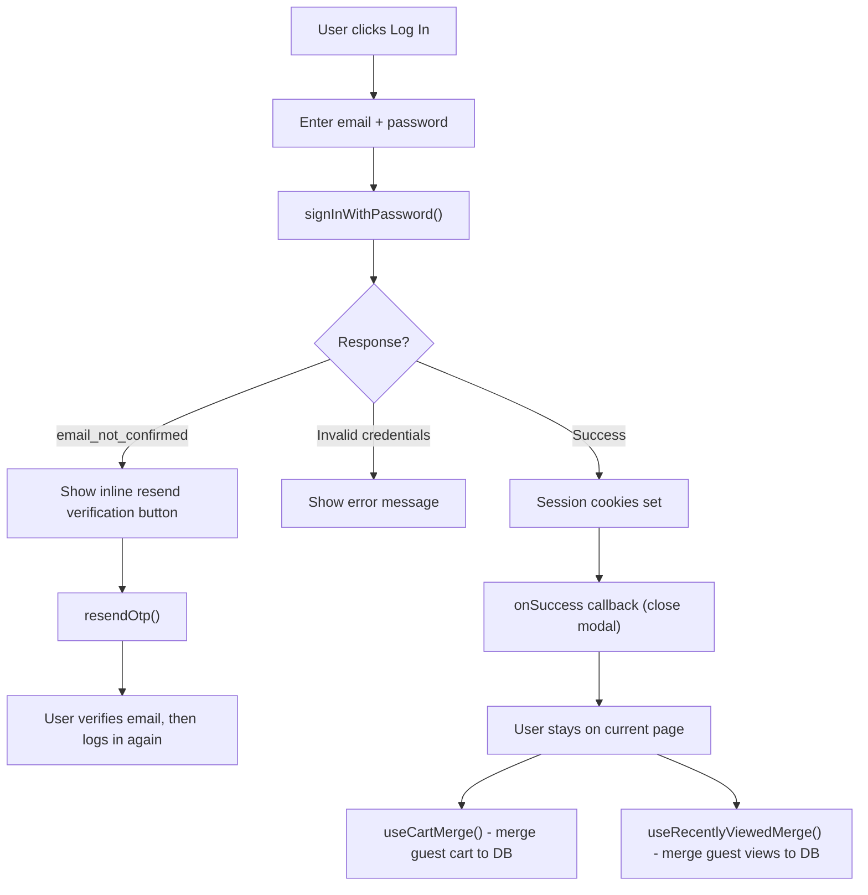
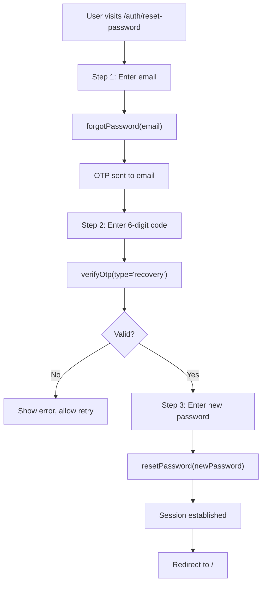
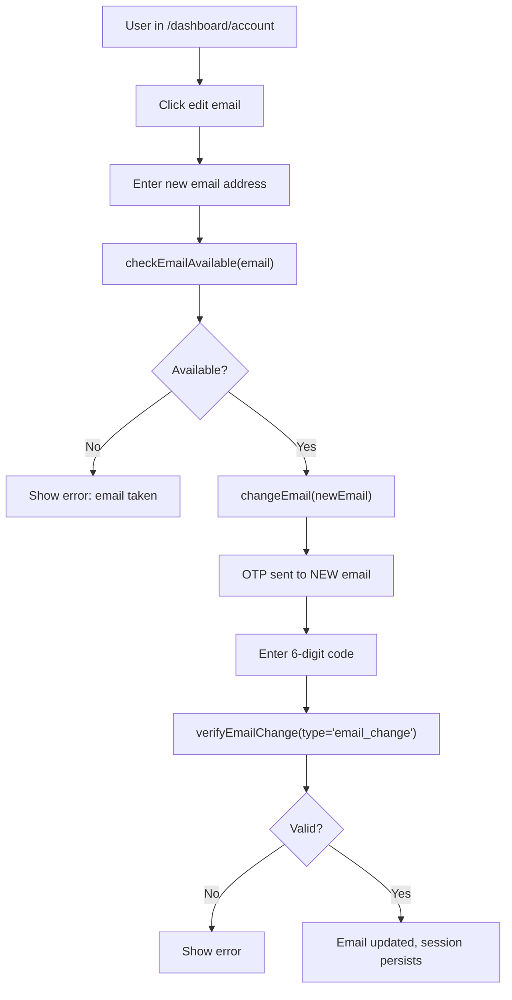
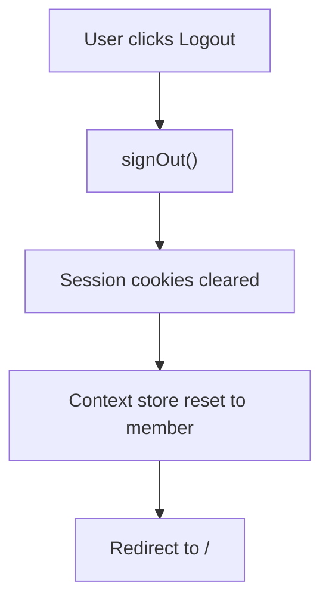

# Auth Flows

All authentication journeys: signup, login, password reset, email change, logout.

## Signup (Email + OTP)



## Login



## Password Reset (3-step)



## Email Change (Authenticated)



## Logout



## Route Protection (proxy.ts)

```mermaid
flowchart TD
    A[Any request] --> B{Path?}
    B -->|"/api/*" or "/_next/*" or "/auth/*"| C[Skip auth check, pass through]
    B -->|"/dashboard/*"| D["getUser() - verify JWT from cookies"]
    D --> E{Authenticated?}
    E -->|No| F["Redirect to /"]
    E -->|Yes| G{Path is /onboarding?}
    G -->|Yes| H{onboarding_completed_at set?}
    H -->|Yes| I["Redirect to / (already onboarded)"]
    H -->|No| J[Allow through to onboarding]
    G -->|No| K[Allow through to dashboard]
    B -->|Public pages| L[Refresh session cookies, allow through]
```
