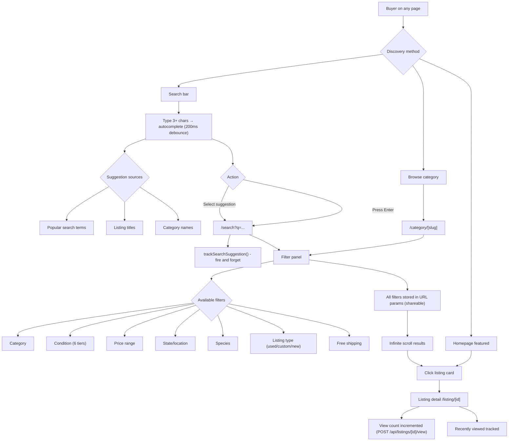
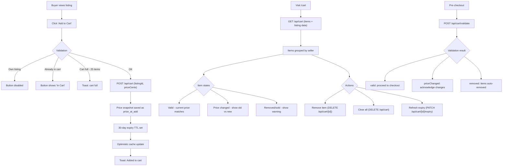
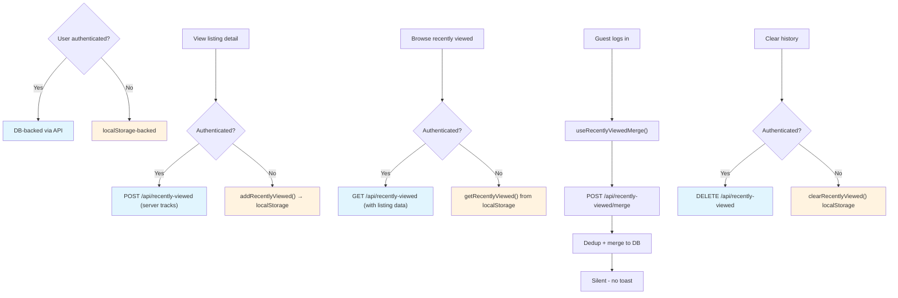
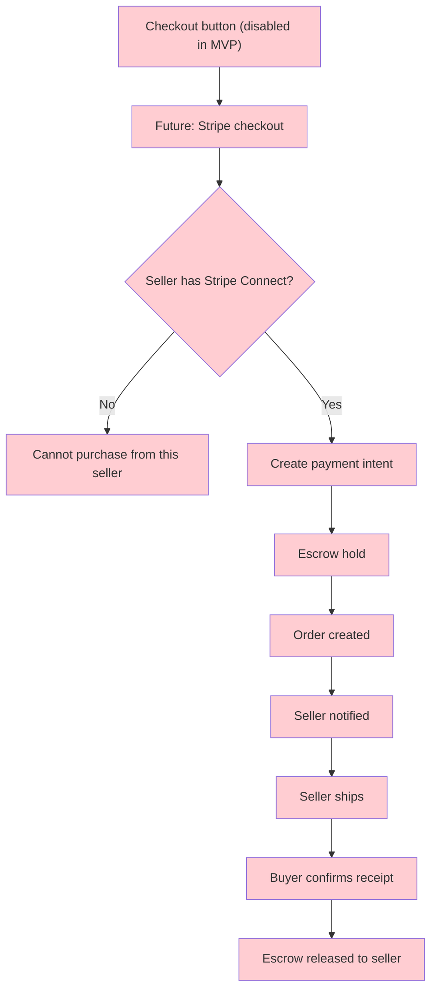

# Buyer Flows

Authenticated buyer: search, filter, cart, recently viewed, checkout.

## Search & Discovery

```mermaid
flowchart TD
    A[Buyer on any page] --> B{Discovery method}

    B --> C[Search bar]
    C --> D["Type 3+ chars → autocomplete (200ms debounce)"]
    D --> E{Suggestion sources}
    E --> F[Popular search terms]
    E --> G[Listing titles]
    E --> H[Category names]
    D --> I{Action}
    I -->|Select suggestion| J["/search?q=..."]
    I -->|Press Enter| J
    J --> K["trackSearchSuggestion() - fire and forget"]

    B --> L[Browse category]
    L --> M["/category/[slug]"]

    B --> N[Homepage featured]
    N --> O[Click listing card]

    J --> P[Filter panel]
    M --> P
    P --> Q{Available filters}
    Q --> R[Category]
    Q --> S["Condition (6 tiers)"]
    Q --> T[Price range]
    Q --> U[State/location]
    Q --> V[Species]
    Q --> W["Listing type (used/custom/new)"]
    Q --> X[Free shipping]
    P --> Y["All filters stored in URL params (shareable)"]
    Y --> Z[Infinite scroll results]

    Z --> O
    O --> AA["Listing detail /listing/[id]"]
    AA --> AB["View count incremented (POST /api/listings/[id]/view)"]
    AA --> AC["Recently viewed tracked"]
```

## Authenticated Cart

```mermaid
flowchart TD
    A[Buyer views listing] --> B["Click 'Add to Cart'"]
    B --> C{Validation}
    C -->|Own listing| D[Button disabled]
    C -->|Already in cart| E[Button shows 'In Cart']
    C -->|Cart full - 25 items| F[Toast: cart full]
    C -->|OK| G["POST /api/cart (listingId, priceCents)"]
    G --> H[Price snapshot saved as price_at_add]
    H --> I[30-day expiry TTL set]
    I --> J[Optimistic cache update]
    J --> K[Toast: Added to cart]

    L["Visit /cart"] --> M["GET /api/cart (items + listing data)"]
    M --> N[Items grouped by seller]
    N --> O{Item states}
    O --> P[Valid - current price matches]
    O --> Q[Price changed - show old vs new]
    O --> R[Removed/sold - show warning]

    N --> S{Actions}
    S --> T["Remove item (DELETE /api/cart/[id])"]
    S --> U["Clear all (DELETE /api/cart)"]
    S --> V["Refresh expiry (PATCH /api/cart/[id]/expiry)"]

    W["Pre-checkout"] --> X["POST /api/cart/validate"]
    X --> Y{Validation result}
    Y --> Z[valid: proceed to checkout]
    Y --> AA[priceChanged: acknowledge changes]
    Y --> AB[removed: items auto-removed]
```

## Recently Viewed (Dual-Source)

```mermaid
flowchart TD
    A{User authenticated?} -->|Yes| B[DB-backed via API]
    A -->|No| C[localStorage-backed]

    D[View listing detail] --> E{Authenticated?}
    E -->|Yes| F["POST /api/recently-viewed (server tracks)"]
    E -->|No| G["addRecentlyViewed() → localStorage"]

    H["Browse recently viewed"] --> I{Authenticated?}
    I -->|Yes| J["GET /api/recently-viewed (with listing data)"]
    I -->|No| K["getRecentlyViewed() from localStorage"]

    L[Guest logs in] --> M["useRecentlyViewedMerge()"]
    M --> N["POST /api/recently-viewed/merge"]
    N --> O[Dedup + merge to DB]
    O --> P[Silent - no toast]

    Q[Clear history] --> R{Authenticated?}
    R -->|Yes| S["DELETE /api/recently-viewed"]
    R -->|No| T["clearRecentlyViewed() localStorage"]

    style C fill:#fff3e0
    style G fill:#fff3e0
    style K fill:#fff3e0
    style T fill:#fff3e0
    style B fill:#e1f5fe
    style F fill:#e1f5fe
    style J fill:#e1f5fe
    style S fill:#e1f5fe
```

## Checkout (NOT BUILT)

```mermaid
flowchart TD
    A["Checkout button (disabled in MVP)"] --> B[Future: Stripe checkout]
    B --> C{Seller has Stripe Connect?}
    C -->|No| D[Cannot purchase from this seller]
    C -->|Yes| E[Create payment intent]
    E --> F[Escrow hold]
    F --> G[Order created]
    G --> H[Seller notified]
    H --> I[Seller ships]
    I --> J[Buyer confirms receipt]
    J --> K[Escrow released to seller]

    style A fill:#ffcdd2
    style B fill:#ffcdd2
    style C fill:#ffcdd2
    style D fill:#ffcdd2
    style E fill:#ffcdd2
    style F fill:#ffcdd2
    style G fill:#ffcdd2
    style H fill:#ffcdd2
    style I fill:#ffcdd2
    style J fill:#ffcdd2
    style K fill:#ffcdd2
```
