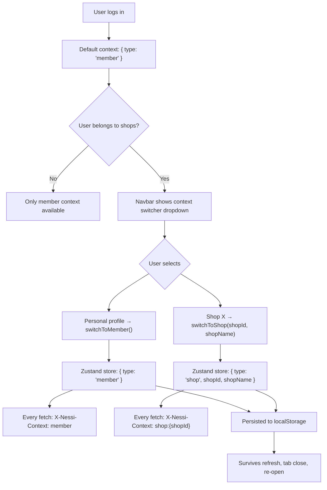
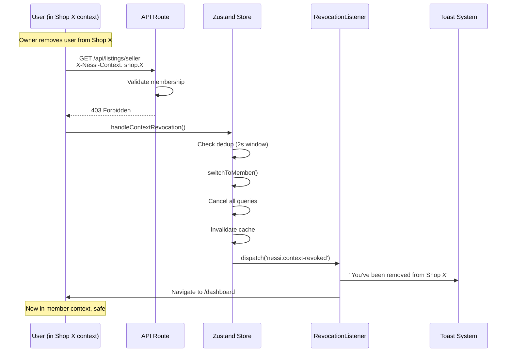
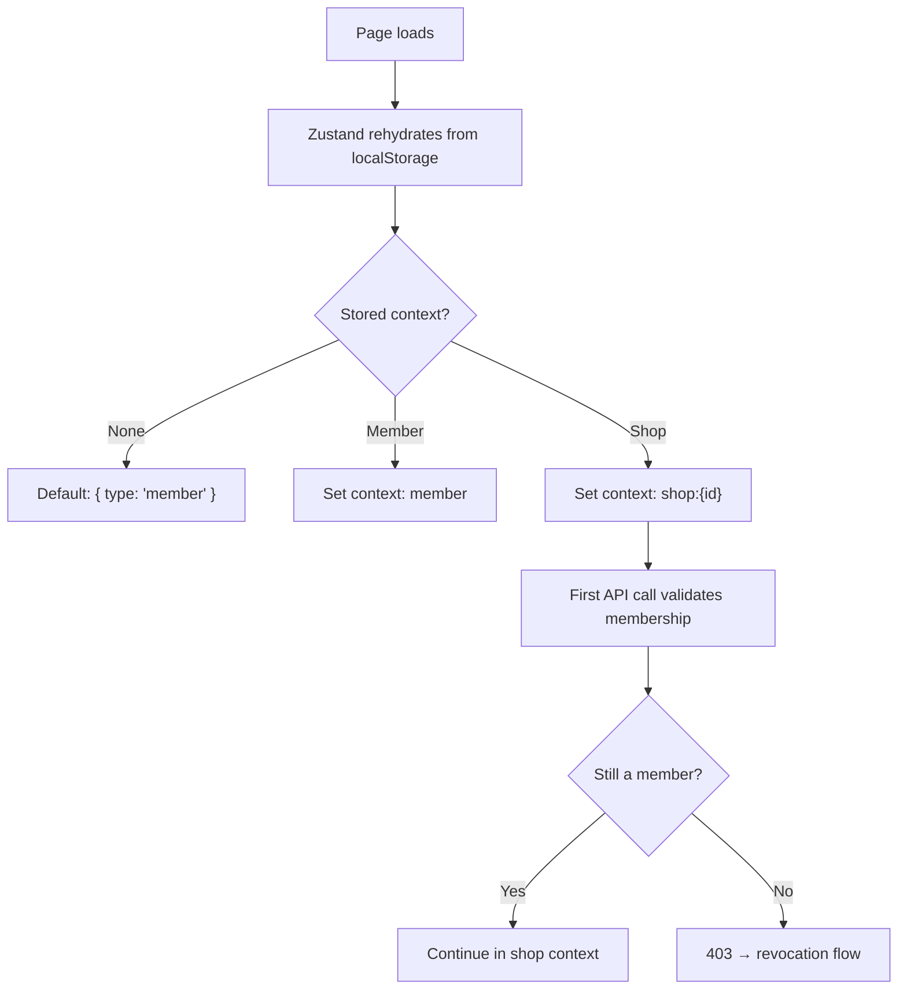
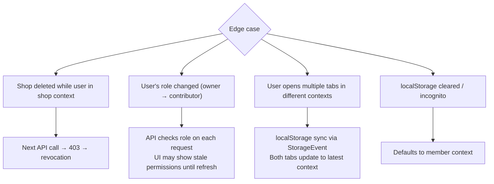

# Context Switching Flows

Member/shop identity switching, the X-Nessi-Context header, and revocation safety.

## Identity System Overview



## How Context Affects Operations

```mermaid
flowchart TD
    A{Operation} --> B[Create listing]
    A --> C[View dashboard]
    A --> D[Edit shop settings]
    A --> E[Upload assets]

    B --> F{Context?}
    F -->|Member| G["listing.member_id = user.id\nlisting.shop_id = null"]
    F -->|Shop| H["listing.member_id = null\nlisting.shop_id = shopId"]
    G --> I[Appears on /member/[slug]]
    H --> J[Appears on /shop/[slug]]

    C --> K{Context?}
    K -->|Member| L[Personal dashboard KPIs]
    K -->|Shop| M[Shop dashboard KPIs]

    D --> N{Context?}
    N -->|Member| O[No shop settings available]
    N -->|Shop| P[Shop settings based on role]

    E --> Q{Context?}
    Q -->|Member| R["Upload to members/{userId}/"]
    Q -->|Shop| S["Upload to shops/{shopId}/"]
```

## Revocation Safety Net



## Context on Page Load



## Edge Cases


