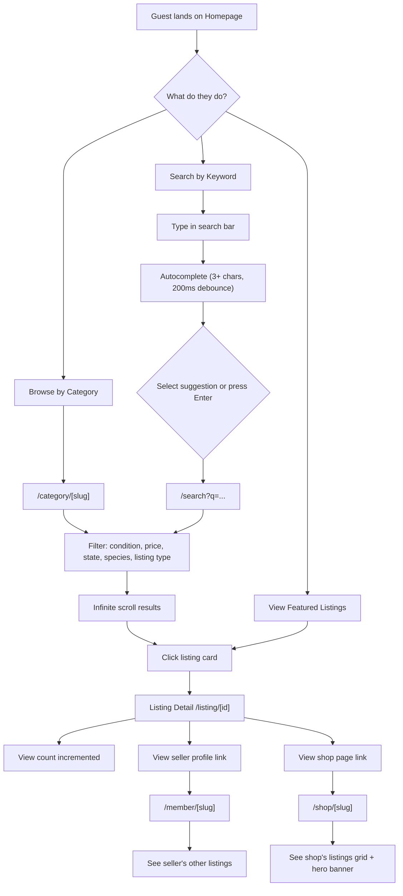
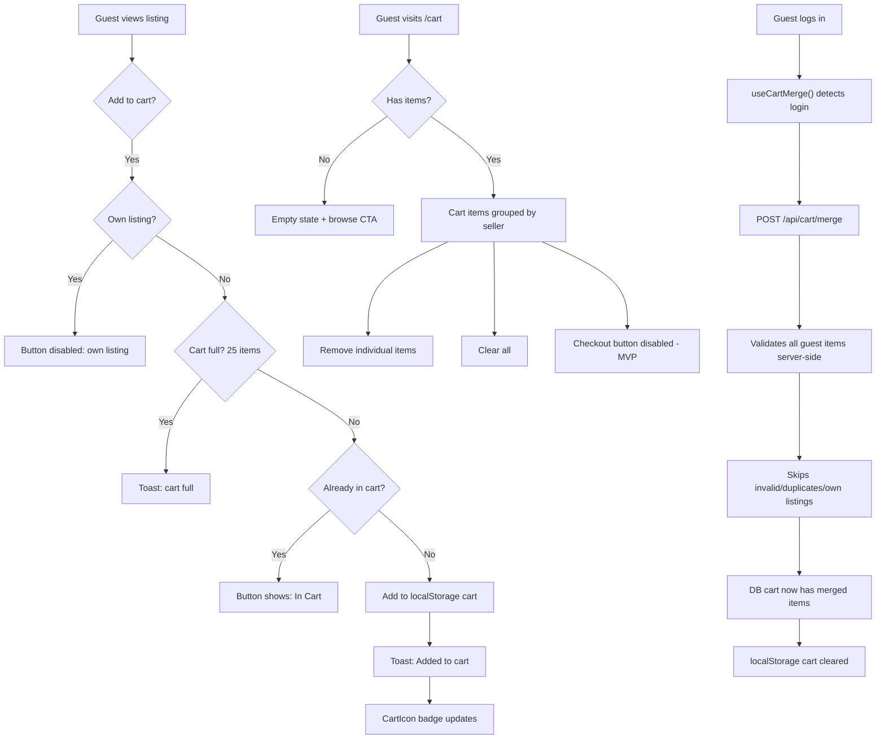
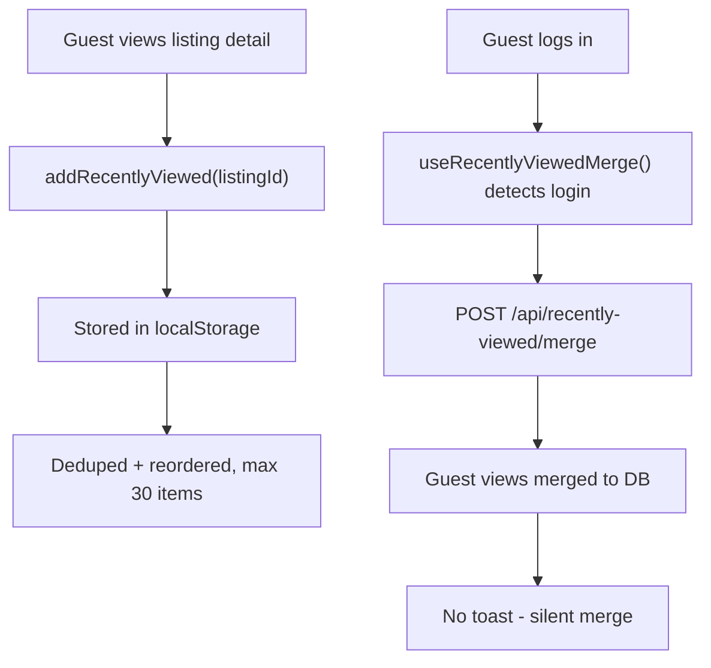

# Guest Flows

Unauthenticated user browsing, searching, and managing a guest cart.

## Browse & Discover

```mermaid
flowchart TD
    A[Guest lands on Homepage] --> B{What do they do?}
    B --> C[Browse by Category]
    B --> D[Search by Keyword]
    B --> E[View Featured Listings]

    C --> F["/category/[slug]"]
    F --> G[Filter: condition, price, state, species, listing type]
    G --> H[Infinite scroll results]

    D --> I[Type in search bar]
    I --> J["Autocomplete (3+ chars, 200ms debounce)"]
    J --> K{Select suggestion or press Enter}
    K --> L["/search?q=..."]
    L --> G

    H --> M[Click listing card]
    E --> M
    M --> N["Listing Detail /listing/[id]"]
    N --> O[View count incremented]
    N --> P[View seller profile link]
    N --> Q[View shop page link]
    P --> R["/member/[slug]"]
    Q --> S["/shop/[slug]"]
    R --> T[See seller's other listings]
    S --> U[See shop's listings grid + hero banner]
```

## Guest Cart

```mermaid
flowchart TD
    A[Guest views listing] --> B{Add to cart?}
    B -->|Yes| C{Own listing?}
    C -->|Yes| D[Button disabled: own listing]
    C -->|No| E{Cart full? 25 items}
    E -->|Yes| F[Toast: cart full]
    E -->|No| G{Already in cart?}
    G -->|Yes| H[Button shows: In Cart]
    G -->|No| I[Add to localStorage cart]
    I --> J[Toast: Added to cart]
    J --> K[CartIcon badge updates]

    L[Guest visits /cart] --> M{Has items?}
    M -->|No| N[Empty state + browse CTA]
    M -->|Yes| O[Cart items grouped by seller]
    O --> P[Remove individual items]
    O --> Q[Clear all]
    O --> R[Checkout button disabled - MVP]

    S[Guest logs in] --> T["useCartMerge() detects login"]
    T --> U["POST /api/cart/merge"]
    U --> V[Validates all guest items server-side]
    V --> W[Skips invalid/duplicates/own listings]
    W --> X[DB cart now has merged items]
    X --> Y[localStorage cart cleared]
```

## Guest Recently Viewed

```mermaid
flowchart TD
    A[Guest views listing detail] --> B["addRecentlyViewed(listingId)"]
    B --> C[Stored in localStorage]
    C --> D[Deduped + reordered, max 30 items]

    E[Guest logs in] --> F["useRecentlyViewedMerge() detects login"]
    F --> G["POST /api/recently-viewed/merge"]
    G --> H[Guest views merged to DB]
    H --> I[No toast - silent merge]
```
