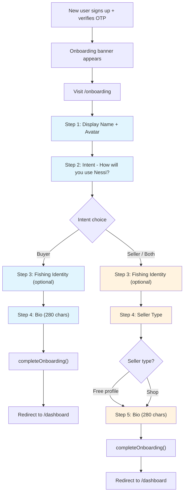
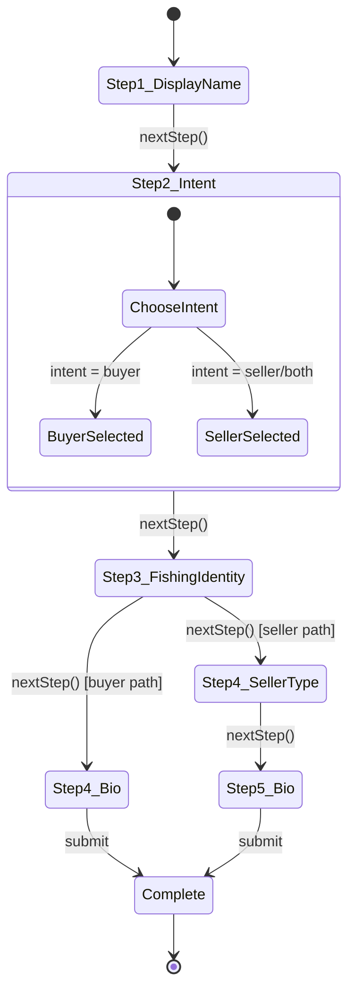
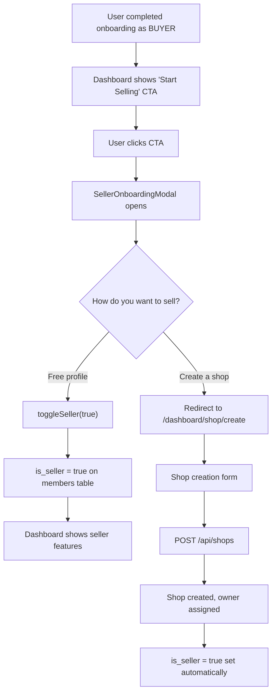

# Onboarding Flows

Branching wizard after first signup. Buyer path (4 steps) vs Seller path (5 steps).

## Onboarding Wizard

```mermaid
flowchart TD
    A[New user signs up + verifies OTP] --> B[Onboarding banner appears]
    B --> C["Visit /onboarding"]

    C --> D["Step 1: Display Name + Avatar"]
    D --> E["Step 2: Intent - How will you use Nessi?"]
    E --> F{Intent choice}

    F -->|Buyer| G["Step 3: Fishing Identity (optional)"]
    G --> H["Step 4: Bio (280 chars)"]
    H --> I["completeOnboarding()"]
    I --> J["Redirect to /dashboard"]

    F -->|Seller / Both| K["Step 3: Fishing Identity (optional)"]
    K --> L["Step 4: Seller Type"]
    L --> M{Seller type?}
    M -->|Free profile| N["Step 5: Bio (280 chars)"]
    M -->|Shop| N
    N --> O["completeOnboarding()"]
    O --> P["Redirect to /dashboard"]

    style D fill:#e1f5fe
    style E fill:#e1f5fe
    style G fill:#e1f5fe
    style H fill:#e1f5fe
    style K fill:#fff3e0
    style L fill:#fff3e0
    style N fill:#fff3e0
```

## Onboarding State (Zustand)

```mermaid
stateDiagram-v2
    [*] --> Step1_DisplayName
    Step1_DisplayName --> Step2_Intent: nextStep()

    Step2_Intent --> Step3_FishingIdentity: nextStep()

    state Step2_Intent {
        [*] --> ChooseIntent
        ChooseIntent --> BuyerSelected: intent = buyer
        ChooseIntent --> SellerSelected: intent = seller/both
    }

    Step3_FishingIdentity --> Step4_Bio: nextStep() [buyer path]
    Step3_FishingIdentity --> Step4_SellerType: nextStep() [seller path]
    Step4_SellerType --> Step5_Bio: nextStep()

    Step4_Bio --> Complete: submit
    Step5_Bio --> Complete: submit
    Complete --> [*]
```

## Post-Onboarding Seller Opt-in

```mermaid
flowchart TD
    A[User completed onboarding as BUYER] --> B[Dashboard shows 'Start Selling' CTA]
    B --> C[User clicks CTA]
    C --> D[SellerOnboardingModal opens]
    D --> E{How do you want to sell?}

    E -->|Free profile| F["toggleSeller(true)"]
    F --> G["is_seller = true on members table"]
    G --> H[Dashboard shows seller features]

    E -->|Create a shop| I["Redirect to /dashboard/shop/create"]
    I --> J[Shop creation form]
    J --> K["POST /api/shops"]
    K --> L[Shop created, owner assigned]
    L --> M["is_seller = true set automatically"]
```
