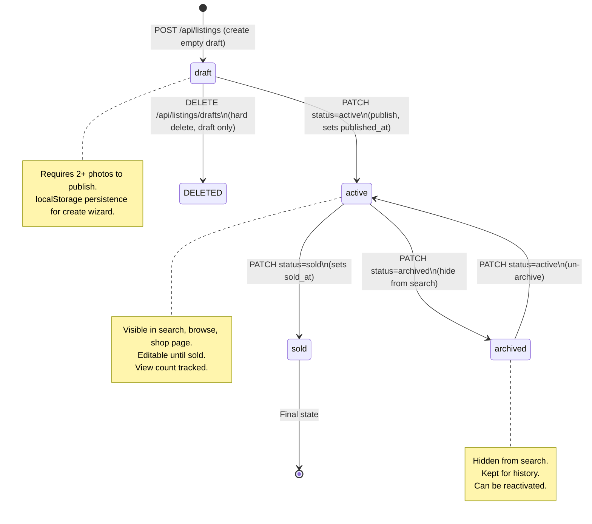
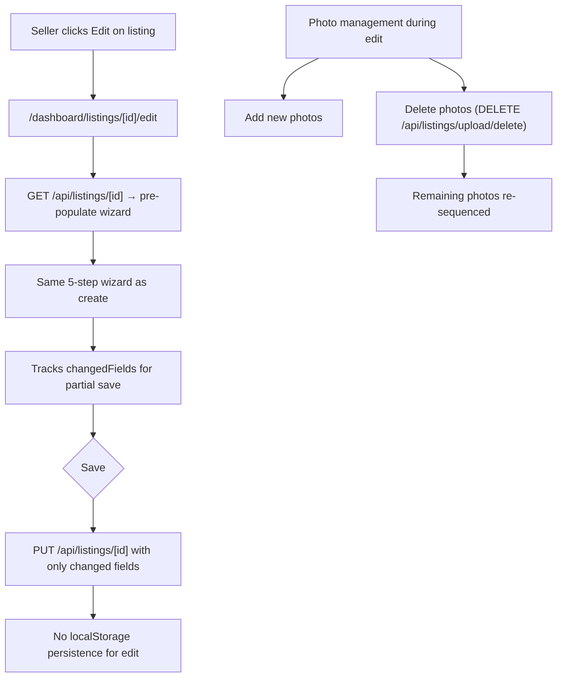
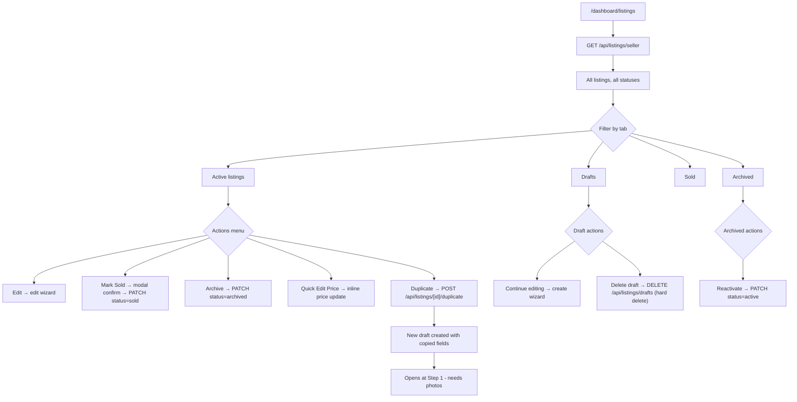
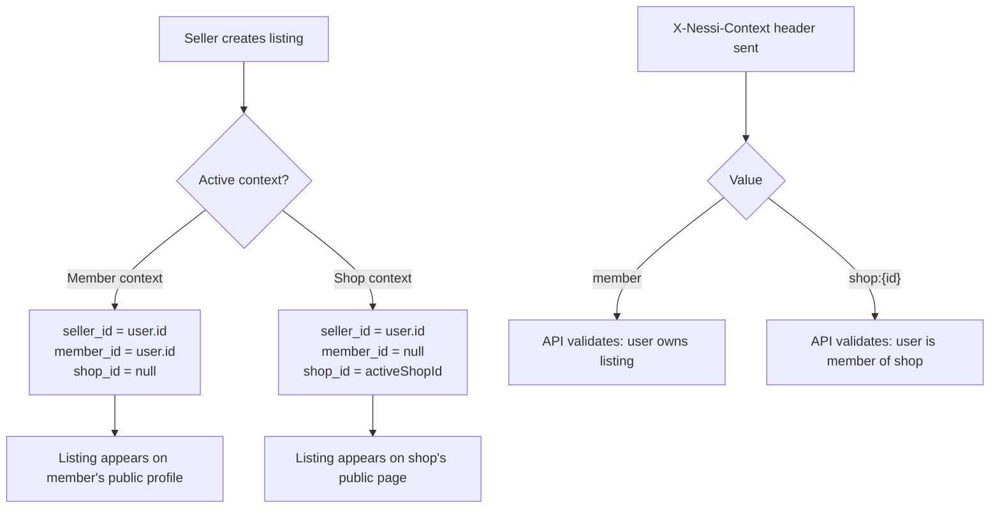
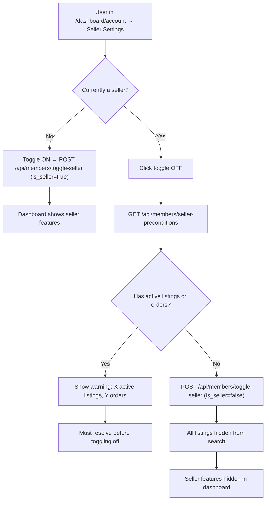

# Seller Flows

Listing lifecycle: create, edit, publish, manage, sold, archive, duplicate, delete.

## Listing Lifecycle (State Machine)



## Create Listing (5-Step Wizard)

```mermaid
flowchart TD
    A["Seller clicks 'New Listing'"] --> B["POST /api/listings/drafts → empty draft created"]
    B --> C["Redirect to /dashboard/listings/new"]

    C --> D["Step 1: Photos"]
    D --> E["Upload via POST /api/listings/upload"]
    E --> F["Sharp: resize 1200x1200 max + 400x400 thumb"]
    F --> G["Stored as WebP in listing-images bucket"]
    G --> H{2+ photos uploaded?}
    H -->|No| I[Cannot proceed to next step]
    H -->|Yes| J["Step 2: Category + Condition"]

    J --> K["Select from 10 categories"]
    K --> L["Select condition (6 tiers)"]
    L --> M["Step 3: Details"]

    M --> N[Title, brand, description]
    N --> O[Species, state, listing type]
    O --> P["Step 4: Pricing + Shipping"]

    P --> Q[Price in dollars, stored as cents]
    Q --> R[Shipping options + rates]
    R --> S["Step 5: Review"]

    S --> T{Action}
    T -->|Save as draft| U[PUT /api/listings/[id] with current fields]
    T -->|Publish| V["PUT listing + PATCH status=active"]
    V --> W["published_at set, visible in search"]

    X[Wizard state] --> Y[Zustand store with localStorage persistence]
    Y --> Z[Survives page refresh / navigation]
```

## Edit Listing



## Dashboard Listing Management



## Seller Context (Member vs Shop)



## Seller Toggle


