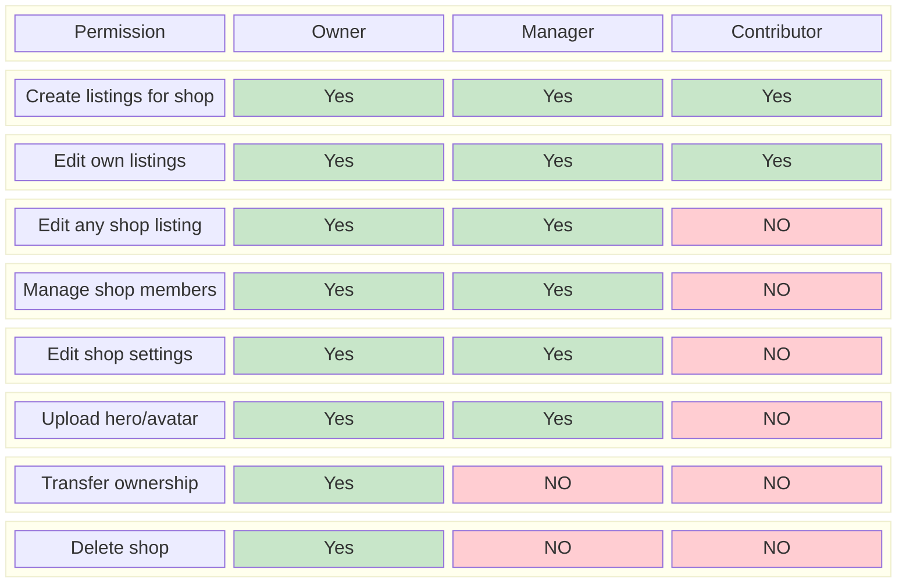
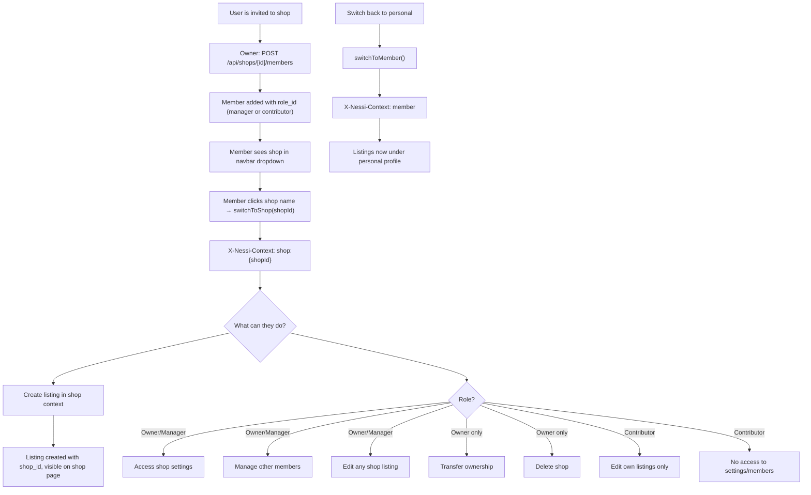
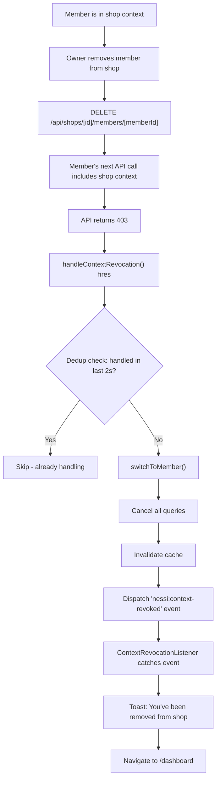
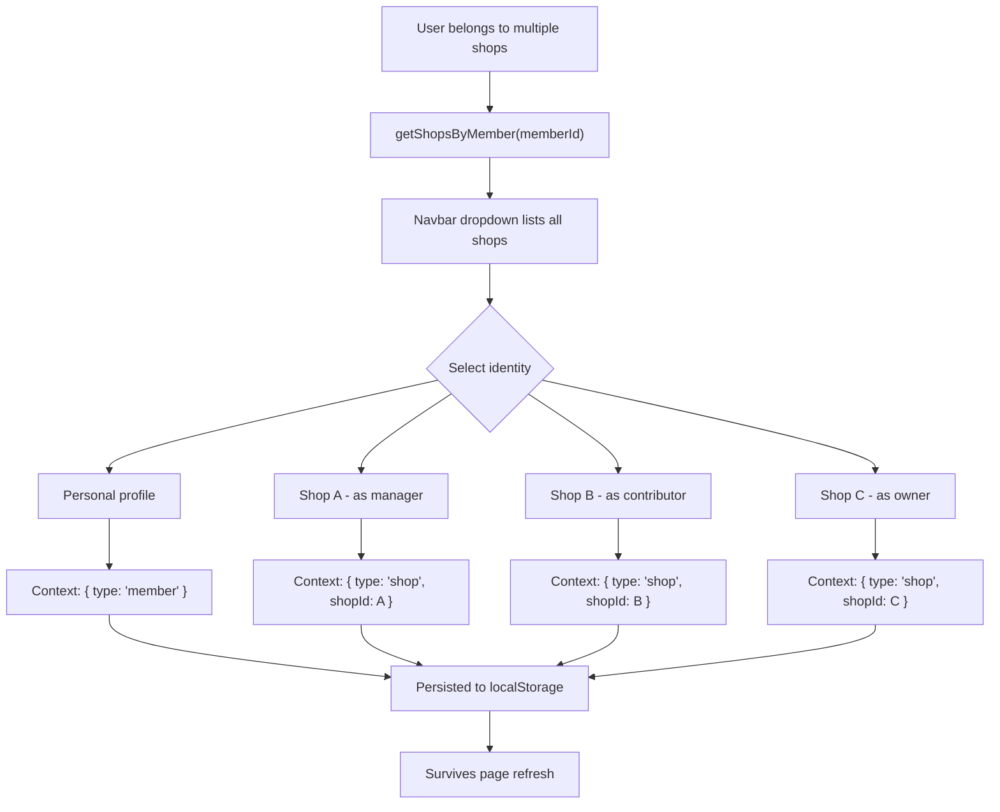

# Shop Member Flows

Role-based access for shop members: owner, manager, contributor.

## Role Permissions Matrix

> **STATUS: Permission enforcement is NOT YET BUILT.** The role structure exists in the DB (shop_roles table with deterministic UUIDs), but UI gating and API-level checks are pending.

## Shop Member Journey

## Context Revocation

## Multi-Shop Member

