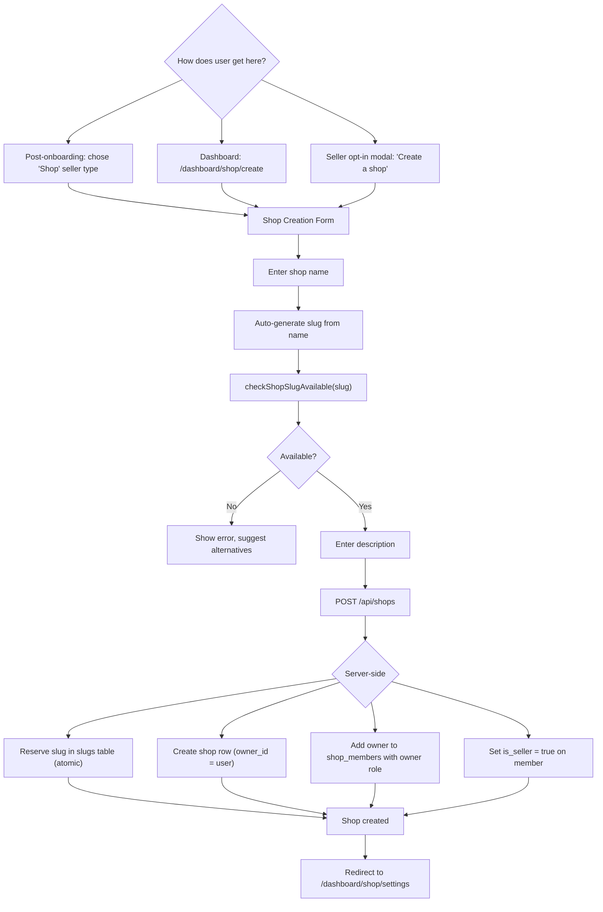
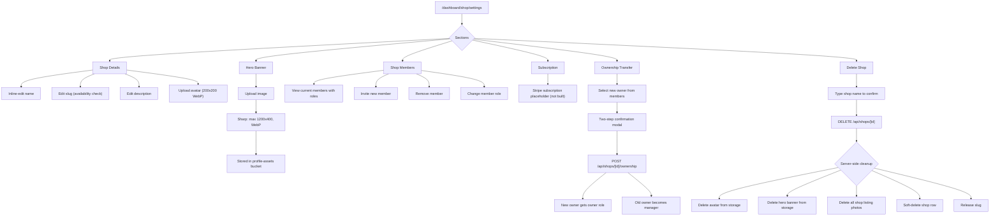
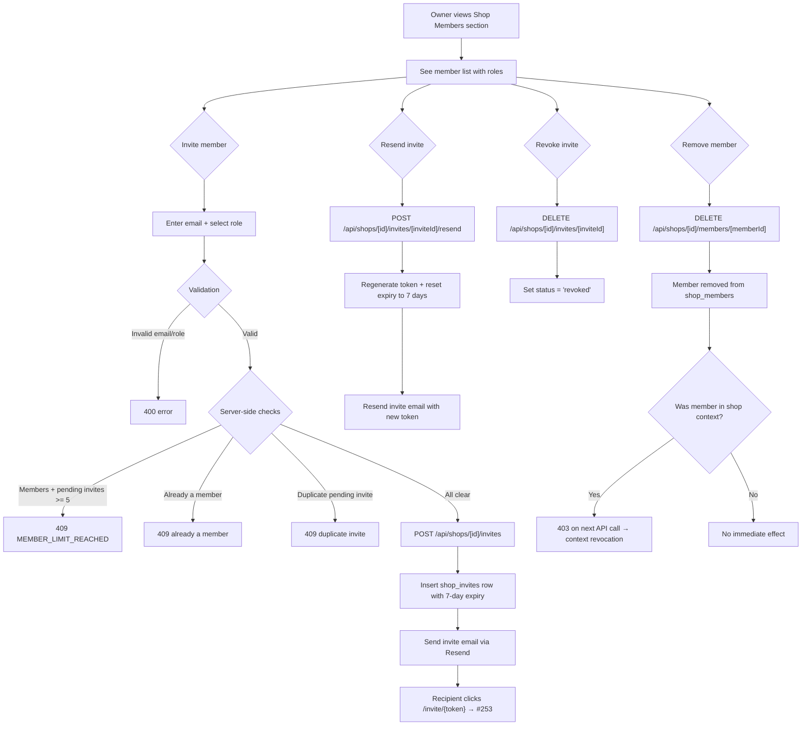
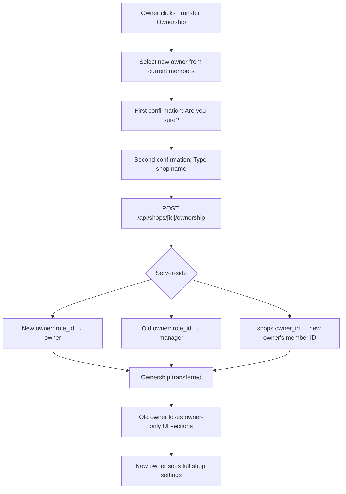

# Shop Owner Flows

Create shop, manage settings, invite members, transfer ownership, delete shop.

## Create Shop

```mermaid
flowchart TD
    A{How does user get here?} --> B["Post-onboarding: chose 'Shop' seller type"]
    A --> C["Dashboard: /dashboard/shop/create"]
    A --> D["Seller opt-in modal: 'Create a shop'"]

    B --> E[Shop Creation Form]
    C --> E
    D --> E

    E --> F[Enter shop name]
    F --> G["Auto-generate slug from name"]
    G --> H["checkShopSlugAvailable(slug)"]
    H --> I{Available?}
    I -->|No| J[Show error, suggest alternatives]
    I -->|Yes| K[Enter description]
    K --> L["POST /api/shops"]
    L --> M{Server-side}
    M --> N["Reserve slug in slugs table (atomic)"]
    M --> O["Create shop row (owner_id = user)"]
    M --> P["Add owner to shop_members with owner role"]
    M --> Q["Set is_seller = true on member"]
    N & O & P & Q --> R[Shop created]
    R --> S["Redirect to /dashboard/shop/settings"]
```

## Shop Settings

```mermaid
flowchart TD
    A["/dashboard/shop/settings"] --> B{Sections}

    B --> C[Shop Details]
    C --> C1[Inline-edit name]
    C --> C2["Edit slug (availability check)"]
    C --> C3[Edit description]
    C --> C4["Upload avatar (200x200 WebP)"]

    B --> D[Hero Banner]
    D --> D1[Upload image]
    D1 --> D2["Sharp: max 1200x400, WebP"]
    D2 --> D3[Stored in profile-assets bucket]

    B --> E[Shop Members]
    E --> E1[View current members with roles]
    E --> E2[Invite new member]
    E --> E3[Remove member]
    E --> E4[Change member role]

    B --> F[Subscription]
    F --> F1["Stripe subscription placeholder (not built)"]

    B --> G[Ownership Transfer]
    G --> G1[Select new owner from members]
    G1 --> G2[Two-step confirmation modal]
    G2 --> G3["POST /api/shops/[id]/ownership"]
    G3 --> G4[New owner gets owner role]
    G3 --> G5[Old owner becomes manager]

    B --> H[Delete Shop]
    H --> H1[Type shop name to confirm]
    H1 --> H2["DELETE /api/shops/[id]"]
    H2 --> H3{Server-side cleanup}
    H3 --> H4[Delete avatar from storage]
    H3 --> H5[Delete hero banner from storage]
    H3 --> H6[Delete all shop listing photos]
    H3 --> H7[Soft-delete shop row]
    H3 --> H8[Release slug]
```

## Member Management

```mermaid
flowchart TD
    A[Owner views Shop Members section] --> B[See member list with roles]

    B --> C{Invite member}
    C --> D[Enter email + select role]
    D --> E{Validation}
    E -->|Invalid email/role| F[400 error]
    E -->|Valid| G{Server-side checks}
    G -->|"Members + pending invites >= 5"| H["409 MEMBER_LIMIT_REACHED"]
    G -->|Already a member| I[409 already a member]
    G -->|Duplicate pending invite| J[409 duplicate invite]
    G -->|All clear| K["POST /api/shops/[id]/invites"]
    K --> L[Insert shop_invites row with 7-day expiry]
    L --> M[Send invite email via Resend]
    M --> N["Recipient clicks /invite/{token} → #253"]

    B --> O{Resend invite}
    O --> P["POST /api/shops/[id]/invites/[inviteId]/resend"]
    P --> Q[Regenerate token + reset expiry to 7 days]
    Q --> R[Resend invite email with new token]

    B --> S{Revoke invite}
    S --> T["DELETE /api/shops/[id]/invites/[inviteId]"]
    T --> U["Set status = 'revoked'"]

    B --> V{Remove member}
    V --> W["DELETE /api/shops/[id]/members/[memberId]"]
    W --> X[Member removed from shop_members]
    X --> Y{Was member in shop context?}
    Y -->|Yes| Z["403 on next API call → context revocation"]
    Y -->|No| AA[No immediate effect]
```

## Ownership Transfer

```mermaid
flowchart TD
    A[Owner clicks Transfer Ownership] --> B[Select new owner from current members]
    B --> C[First confirmation: Are you sure?]
    C --> D[Second confirmation: Type shop name]
    D --> E["POST /api/shops/[id]/ownership"]
    E --> F{Server-side}
    F --> G["New owner: role_id → owner"]
    F --> H["Old owner: role_id → manager"]
    F --> I["shops.owner_id → new owner's member ID"]
    G & H & I --> J[Ownership transferred]
    J --> K[Old owner loses owner-only UI sections]
    K --> L[New owner sees full shop settings]
```
